\newpage

# Introduction 
There is a surprisingly wide range of academic articles addressing voting behaviour in the Eurovision song contest. This paper build on this field which @Gatherer2006 playfully referred to as "eurovisiopsephology". The outstanding interest in this phenomenon is perhaps only partly explained by the popularity of the contest among academics. Much of it stems from evidence showing that voting patterns extend beyond the quality of performances and songs. @GinsburghNoury2005 analysed several determinants of success, highlighting the effects of linguistic and cultural proximities on voting. Similarly, @Stockemer2017 examined the roles of neighbourhood and ethnic voting, while @Fenn2005 connected these patterns to broader agent behaviours in other real-world contexts. 
\
Interestingly, many referenced papers date back to the mid-2000s. We assume that this is because most post-Soviet countries joined the contest in this period, leading to an increase in participating countries, public attention, and cultural diversity. At the time, votes were casted only by the public in form of televoting [@EurovisionWorld2024]. In this paper, we investigate a more recent period, distinguishing between votes awarded through televoting and those allocated by a jury. This is made possible by rule changes in 2016, which introduced the separate announcement of televote and jury points. This framework allows us to evaluate the persistence of voting patterns nearly 20 years later, and to explore their applicability to jury votes.
\
The interest in Eurovision voting extends beyond understanding patterns or predicting future winners. Analysing vote exchanges offers insights into how culture, language, politics, and geography drive bias in voting, and, consequently, agent behaviour in complex social networks. @Fenn2005 observed that Eurovision’s winner is determined through a group self-assessment process. Framing the contest as a game, countries act as agents aim to maximize utility (win). The complexity arises from the dual role of these agents as both participants and voters. If the agents play this “game” optimally, they are incentivized to strategically withhold points from strong competitors, or to strengthen alliances to receive more votes. An alliance in this case refers to the mutual support and shared voting preferences of countries, overt or covert.
\
This voting dynamic is mirrored in other social contexts, such as corporate boards electing leaders, academic peer review committees evaluating research, and sport governance bodies selecting tournament host cities. Consequently, analysing Eurovision voting can provide valuable insights into analogous social networks under similar game conditions.
\
In this complex game, we assess specific network structures indicative of reciprocity and transitivity in voting. Additionally, we examine factors that potentially influence voting behaviour. This paper addresses the following research questions:

> How do cultural, geographical, political, and linguistic proximities influence voting behaviour in the Eurovision Song Contest?

> Do we observe alliance-oriented voting behaviours in the Eurovision Song Contest?

Our game-theoretical framework assumes that, as rational agents, countries would vote strategically. However, @GinsburghNoury2005, analysing votes from 1975 to 2003, found no evidence of systematic vote trading. Instead, they concluded that cultural and linguistic distances explain most observed logrolling effects. This leads us to the following hypotheses:

> **H1** Countries with similar cultural dimension scores are more likely to vote for each other.

> **H2** Countries sharing similar primary languages are more likely to vote for each other.

Although country blocs voting together might suggest geographical influence, geography likely affects voting indirectly by shaping cultural and linguistic similarities. Nonetheless, @Yair1995 argued that geography might independently affect voting, as proximity facilitates cross-border interactions through media like radio and television broadcasts, leading to shared musical tastes in neighbouring areas even without sharing linguistic or cultural ties. This leads us to the hypothesis:

> **H3** Neighbouring countries are more likely to vote for each other.

Some non-academic articles attribute voting biases to politics [@Guisinger2024; @Ruggeri2023]. Examples include consistent mutual support between the UK and Ireland, Finland and Sweden, or Cyprus and Greece. The studied literature does not agree on whether these links occur because of culture, language and geography, or due to politics.
\
Curiously, Cyprus awarded Greece maximum points eight times consecutively while withholding points from Turkey in the same period, shortly after the 1974 Turkish invasion of Cyprus. Another example is Ukraine’s victories in 2016 and 2022, which both occurred shortly after Russian invasions [@Gilbert2022]. These extreme cases suggest direct political effects beyond cultural, linguistic, or geographical factors. This leads us to the hypothesis:

> **H4** Countries with closer political alignments are more likely to vote for each other.

@Doosje2006 analysed reciprocity of Eurovision votes. They looked at the votes in 1996 and compared them to the votes in the previous five years. They found that countries gave fewer points to countries that they received fewer points from in the previous five years. On the other hand, they awarded more points to countries that they received more points from previously. This leads us to the hypothesis:

> **H5** Countries are more likely to vote for another country if they have received votes from them.

@Fenn2005 identified voting cliques, with groups of countries consistently favouring each other. Such tightly connected communities suggest transitivity, where adjacent nodes in the voting network are interconnected. This leads us to the hypothesis:

> **H6** Countries are more likely to vote for each other if they share a preference for a third country.

To test these hypotheses, we employ an Exponential Random Graph Model (ERGM). By modelling these effects simultaneously, the ERGM framework allows us to uncover structural dependencies and latent mechanisms underpinning the Eurovision voting network.
\
In the Methodology section, we outline the steps taken to construct networks and collect data for the exogenous terms. Furthermore, we present the ERG model specification based on the hypotheses. The Results section includes MCMC diagnostics, goodness-of-fit plots and model term estimates, followed by the findings’ implications for broader contexts in the Discussion section. Finally, we conclude.

# Methodology

## Eurovision Votes Dataset 

The data used in this analysis is retrieved from a freely available dataset containing, among other details, the contestants and votes cast each year from 1956 to 2023 [@Burgoyne2023; @Spijkervet2020]. For this study, we focus on the past eight years (2016-2023), as beginning in 2016, votes from the jury and televotes are recorded separately. This distinction allows for independent analysis of jury and televoting networks.
\
In the Eurovision Song Contest, each participating country awards two sets of points (12, 10, 8–1) to its top 10 preferred entries – one set determined by a professional jury and the other by viewers' televoting. Countries cannot vote for their own entries. Some countries that fail to qualify for the finals still participate in the voting process, while the “Big Five” (France, Germany, Italy, Spain, and the UK) qualify automatically.
\
For this study, we aggregate the voting results from eight years into two directed, non-weighted networks (jury and televoting). Only final-round votes are considered, and we focus on the top three scores (8, 10 and 12) awarded each year. An edge is created between two countries if the ratio of country A giving a top-three vote to country B, divided by the number of participations of country B, exceeds a threshold λ. This is represented mathematically as:

$$
E_{ij} =
\begin{cases}
1 & \text{if } \frac{V_{ij}}{P_j} > \lambda \text{ and } V_{ij} > 1 \\
0 & \text{otherwise}
\end{cases}
$$

where E~ij~ represents the edge between nodes i and j, V~ij~ is the number of times Country i votes for Country j (2016-2023), and P~j~ is the number of times country j participated during the same period. @fig-voting depicts the distribution of the voting ratios in the televoting network.


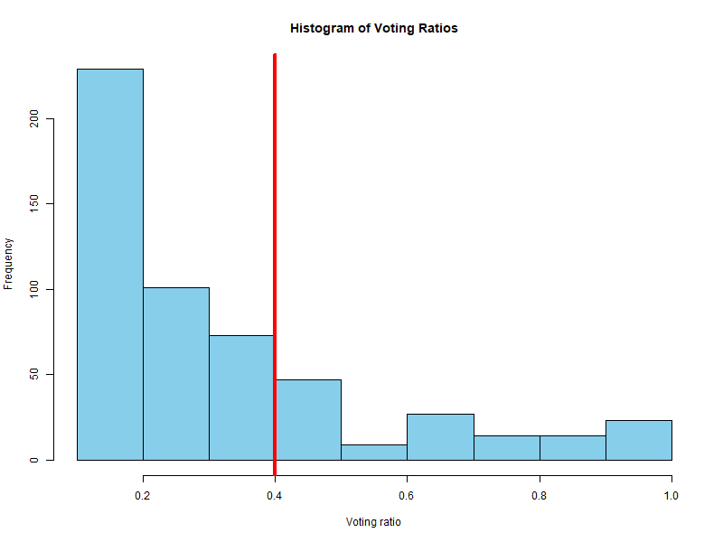{#fig-voting}

The aggregated network is designed to control for quality of songs and performances. We assume that no country consistently produces more universally likeable songs than others. This assumption allows us to model the probabilities of exceeding certain voting thresholds $λ$, had the votes been cast randomly (@fig-probabilities_exceeding_threshold).

::: {#fig-probabilities_exceeding_threshold layout-ncol=2, layout-nrow=2}

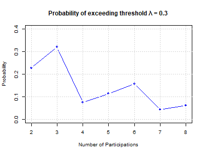{#fig-3}

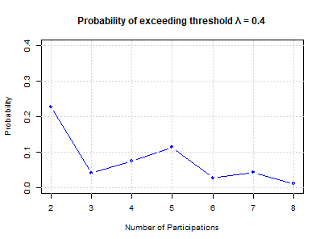{#fig-4}

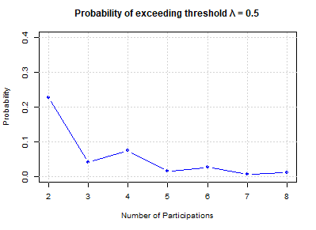{#fig-5}

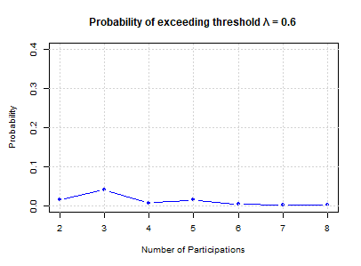{#fig-6}

Thresholds $λ$
:::

@fig-probabilities_exceeding_threshold illustrates the probabilities of edge formation between two countries for varying $λ$ and number of participations. For our analysis, we use $λ$=0.4, which balances a sufficiently connected network with the reasonable assumption that network ties are not purely random. Furthermore, we exclude cases where the number of votes from Country i to j equals 1, as a single vote in one or two participations would surpass $λ$=0.4 without indicating a meaningful tie. @fig-networks presents the resulting televoting (@fig-televoting) and jury (@fig-jury) networks. For completeness, results with $λ$=0.6 are included in the Appendix.

::: {#fig-networks layout-ncol=2, layout-nrow=1}

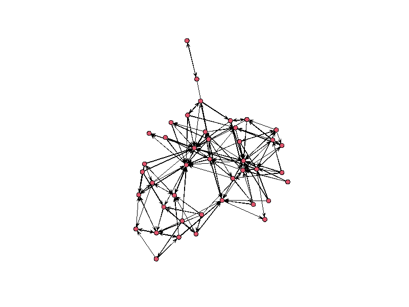{#fig-televoting}

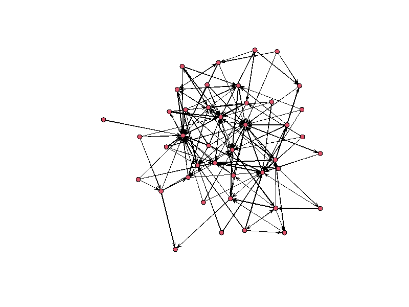{#fig-jury}

Televoting and Jury Networks
:::

## Data for Exogeneous Variables

To examine exogeneous variables, additional data is needed. We include language as a categorical variable. Each country (node) is assigned to a language family based on its primary (dominant) language, with data obtained from @Norton2023 . Measuring language similarity is challenging, as some languages categorized under the same language family might differ more than members of another language family. We selected a level of the language tree that balances diversity and informativeness. The distribution of the language families is shown in @fig-language.

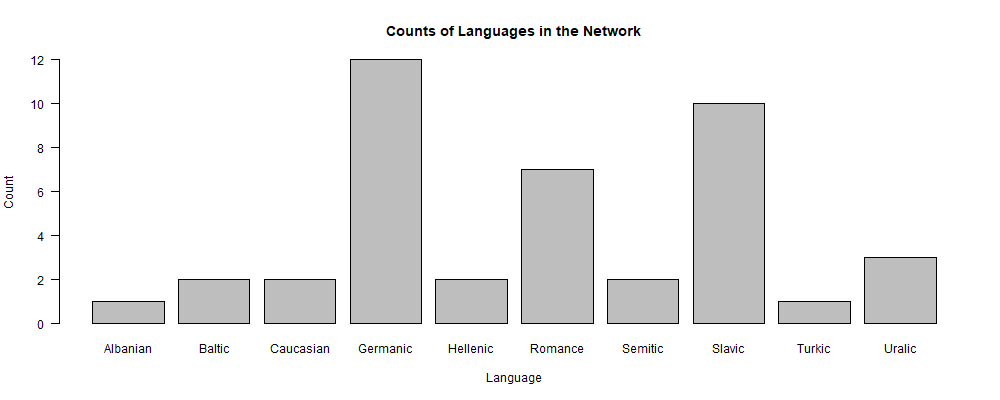{#fig-language}

To measure the effect of culture, we create a matrix of cultural distance between any two countries. Cultural distances between countries are computed using Hofstede’s six cultural dimensions: individualism, power distance, motivation towards achievement and success, uncertainty avoidance, long-term versus short-term orientation, and indulgence versus restraint. Data is sourced from @TheCultureFactor2023 which aggregates findings from multiple scientific studies. The cultural distance between two countries i and j is calculated as:
$$
d_{ij} = \sqrt{\sum_{k=1}^{6} (x_{ik} - x_{jk})^2}
$$
where x~ik~ is the k~th~ cultural dimension score of Country i. 
\
To study neighbourhood effect, a binary matrix is created where
$$
n_{ij} =
\begin{cases}
1 & \text{if countries i and j are neighbours} \\
0 & \text{otherwise}
\end{cases}
$$
\
Political alignment is measured as the number of times two countries vote identically on issues in the UN General Assembly since 2020. This is represented as:
$$
p_{ij} = \sum_{k=1}^{N} 1(v_{ik} = v_{jk})
$$
where v~ik~ is Country i’s vote on issue k, N is the total number of issues, and **1**() is an indicator function that equals 1 if the votes match and 0 otherwise.

## Model Specification

To test the hypotheses, specific terms are included in the ERGM, as outlined in @tbl-hypotheses_table. *Edgecov cultural distance* captures the effect of cultural similarity, as countries with smaller cultural distances may be more likely to vote for each other. *Nodematch language assesses* whether countries sharing similar languages are more likely to exchange votes. *Edgecov neighbour matrix* incorporates geographical proximity, reflecting the influence of neighbouring countries on voting. *Edgecov politics matrix* tests whether political alignment influences voting, as countries with similar political stances may favour each other. The *mutual* term models *reciprocal* voting, addressing the hypothesis that countries are more likely to vote for those who vote for them. *Gwesp (OSP)* captures the tendency for countries with shared preferences for a third country (Outgoing Shared Partners) to vote for each other. 

| H no. | Hypothesis                                                                 | Model term                                   |
|-------|---------------------------------------------------------------------------|--------------------------------------------|
| H1    | Countries with similar cultural dimension scores are more likely to exchange votes. | edgecov – cultural distance  |
| H2    | Countries that share similar primary languages are more likely to vote for each other. | nodematch – language     |
| H3    | Neighbouring countries are more likely to exchange votes.                | edgecov – neighbour matrix  |
| H4    | Countries with closer political alignments are more likely to vote for each other. | edgecov – politics matrix |
| H5    | Countries are more likely to vote for another country if they get a vote from that country. | mutual 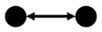                 |
| H6    | Countries are more likely to exchange votes if they have a shared preference for a third country. | gwesp OSP 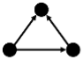              |

: Hypotheses and Corresponding Model Terms {#tbl-hypotheses_table}


## Research Rationale
An ERGM is well-suited to test these hypotheses because it models the network structure of Eurovision voting while accounting for relational dependencies. By using ERGM, we can explicitly examine the effects of factors such as cultural similarity, language, geographical proximity, political alignment, reciprocal voting behaviours, and shared preferences for third countries on the likelihood of vote exchanges.
\
Other methods, such as regression models or traditional network analyses, have been used to explore these relationships. However, ERGM offers distinct advantages by explicitly capturing complex dependencies, including reciprocity (mutual voting), transitivity (shared preferences), and homophily (similarity in cultural, linguistic, or political characteristics). These nuanced dependencies are challenging to model with simpler methods, making ERGM the optimal approach for understanding the underlying structure of Eurovision voting behaviours.

# Results
In this section, the final ERG models selected to illustrate the televoting and jury networks are presented.

## Televoting Network Results
The final ERGMs for the televoting network were selected after comparing multiple configurations. Exogenous terms were added iteratively, and their AIC/BIC scores were evaluated to retain only those that meaningfully explained observed network patterns.

| Model                   | Model 1  | Model 2  | **Model 3**  | Model 4  |
|-------------------------|----------|----------|----------|----------|
| edges                   | -2.92 *** | -1.42 *** | -2.02 *** | -2.19 *** |
| nodematch.language      | 1.27 *** | 0.84 ***  | 0.67 **  | 0.66 **  |
| edgecov.cult_dist       |          | -3.15 *** | -2.21 ** | -2.22 ** |
| edgecov.neighbour       |          |          | 1.46 *** | 1.46 *** |
| edgecov.politics        |          |          |          | 0.23     |
| AIC                     | 834.04   | 811.79    | 781.31   | 783.10   |
| BIC                     | 844.94   | 828.15    | 803.12   | 810.36   |
| log likelihood          | -415.02  | -402.90   | -386.66  | -386.55  |

: Televoting network results {#tbl-televoting-results}

@tbl-televoting-results indicates that the lowest AIC/BIC scores were achieved with Model 3. These scores increased slightly when the politics matrix was included, leading to its exclusion from the final model.
\
Given the small network size, we could combine more endogenous terms in our specification without the drawback of significantly increased computational times. The final model includes the gwesp (OSP) and mutual terms (aligned with our hypotheses) as well as control terms (gwidegree and gwodegree) to improve fit.
\
The final specification of the ERGM for the televoting network is shown in the code below \ref(final). The simulation completes in only a few minutes. Before analysing the estimates for our terms in the model results, we first need to make sure that the simulation ran properly and that the model produces a sufficient goodness of fit.

```{r final, output = FALSE, eval=FALSE}
model_tele <- ergm::ergm(
  network_tele ~ edges +  mutual +
    gwesp(0.75, fixed = TRUE, type = "OSP") + 
    gwidegree(0.25, fixed = TRUE) +
    gwodegree(0.5, fixed = TRUE) +
    nodematch("language") +
    edgecov(cultural_dist_matrix_scaled) +
  edgecov(neighbor_matrix),
  control = ergm::control.ergm(
    MCMC.burnin = 7000,
    MCMC.samplesize = 20000,
    seed = 1234,
    MCMLE.maxit = 40,
    parallel = 8,
    parallel.type = "PSOCK"
  ))
```

### MCMC Diagnostics

As shown in @fig-mcmc-televoting and @fig-mcmc-televoting-p2, the trace plots on the left-hand side are fuzzy and centred around 0, indicating a thorough exploration of parameter space. The right-hand side plots display normally distributed parameter estimates, centred around 0. These plots indicate that our simulations worked properly.

::: {#fig-mcmc-televoting layout-ncol=1, layout-nrow=8, width=20px}

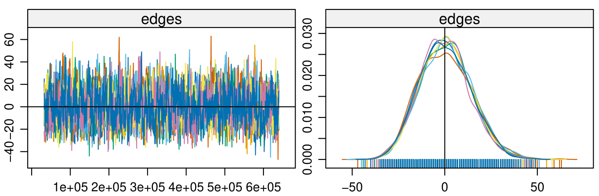{#fig-mcmc-televoting-1}

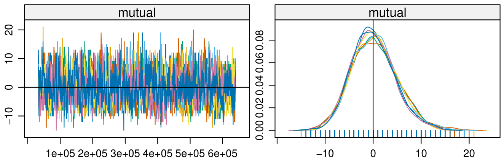{#fig-mcmc-televoting-2}

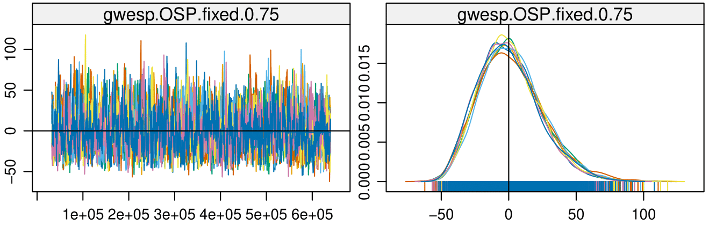{#fig-mcmc-televoting-3}

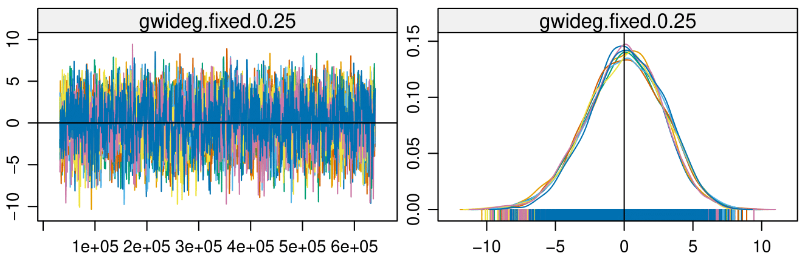{#fig-mcmc-televoting-4}

MCMC Diagnostics Televoting Part 1
:::

::: {#fig-mcmc-televoting-p2 layout-ncol=1, layout-nrow=8, width=20px}

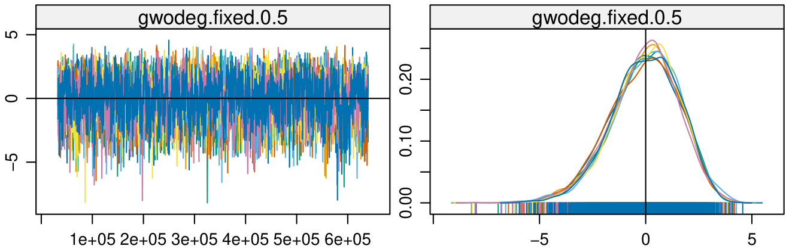{#fig-mcmc-televoting-5}

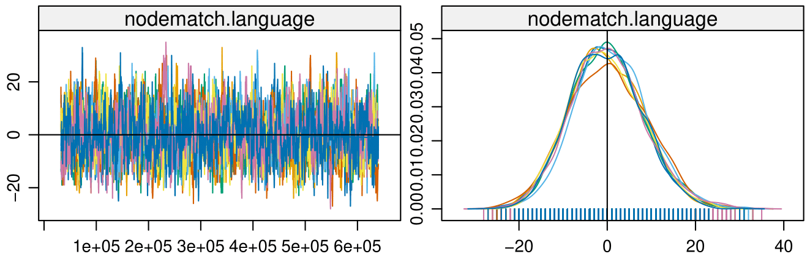{#fig-mcmc-televoting-6}

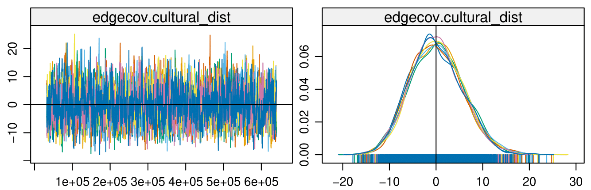{#fig-mcmc-televoting-7}

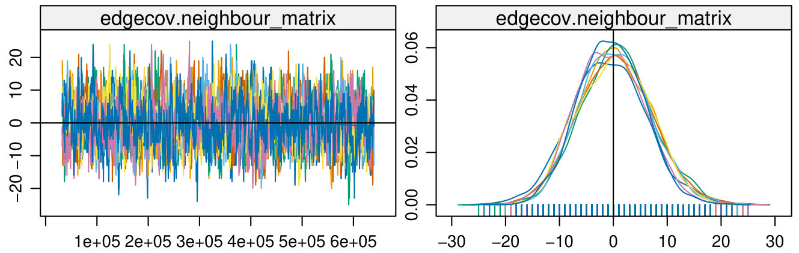{#fig-mcmc-televoting-8}

MCMC Diagnostics Televoting Part 2
:::

### Goodness-of-Fit

We can now observe the goodness of fit of the model. While there could be improvements, overall it has a good fit. The minimum geodesic distance plot highlights a slight discrepancy. The model underestimates the proportion of non-reachable dyads (NR) compared to the observed network. This implies the observed network has more nodes with no incoming edges than the model predicts.


::: {#fig-goodness-of-fit-televoting layout-ncol=2, layout-nrow=3}

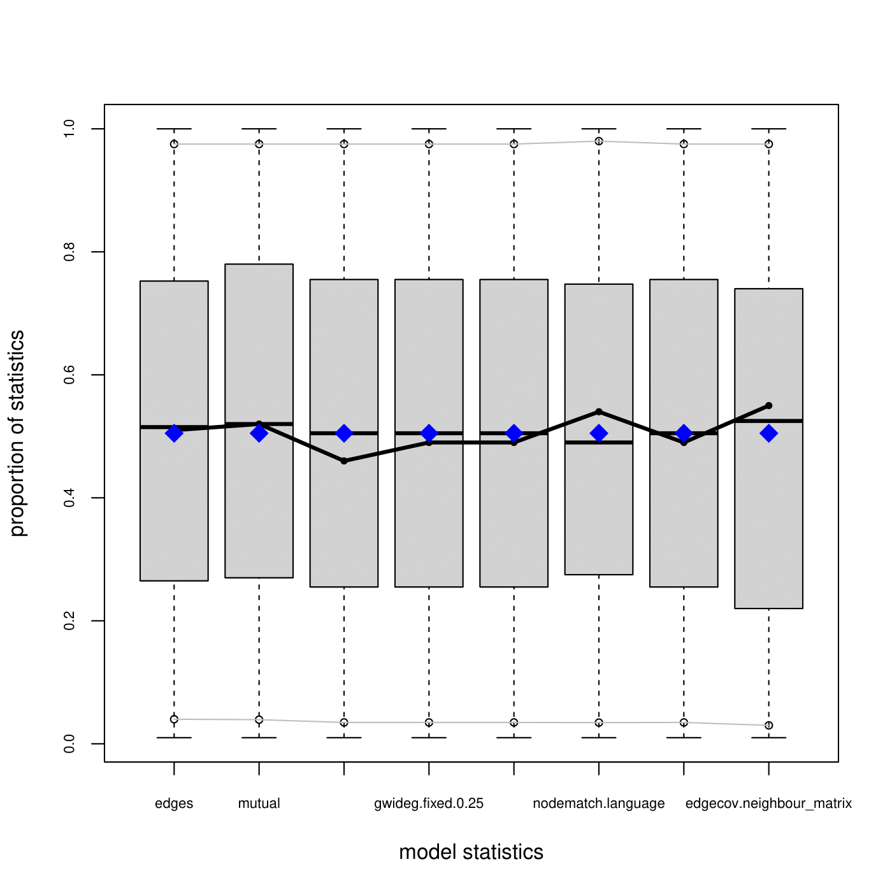{#fig-gof-televoting-1}

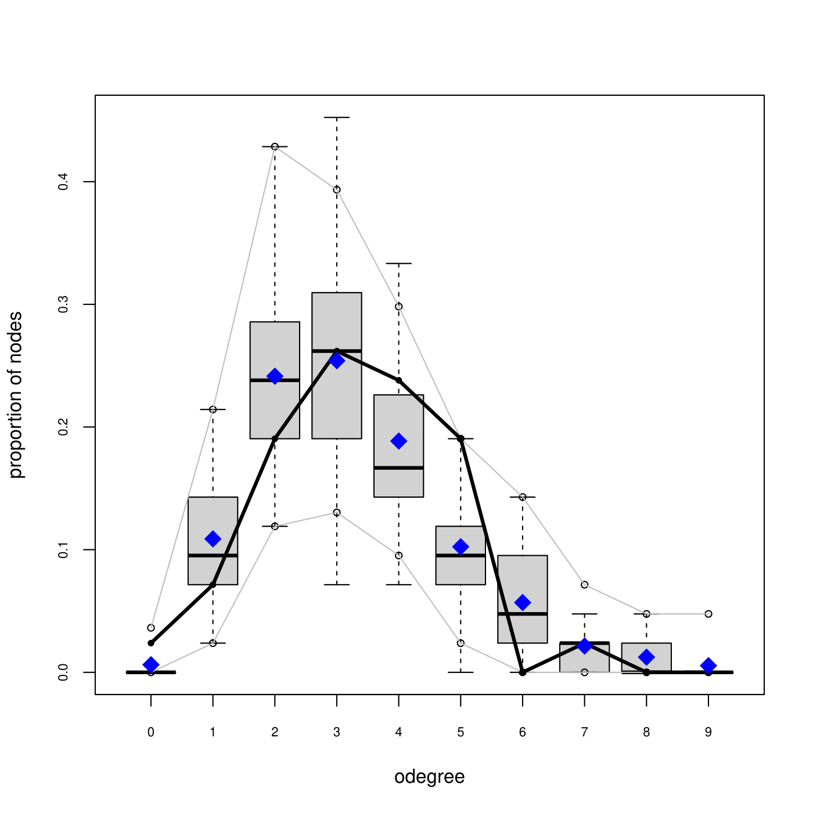{#fig-gof-televoting-2}

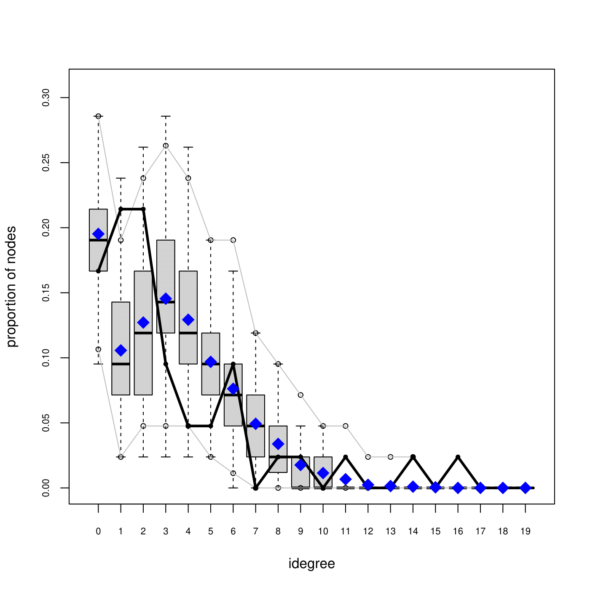{#fig-gof-televoting-3}

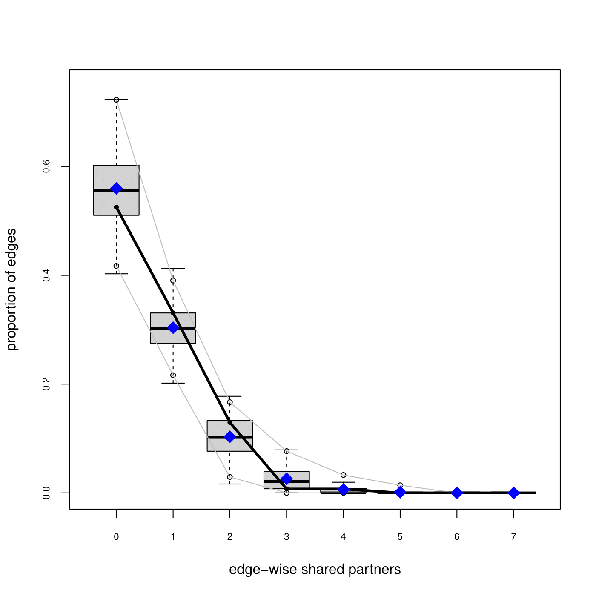{#fig-gof-televoting-4}

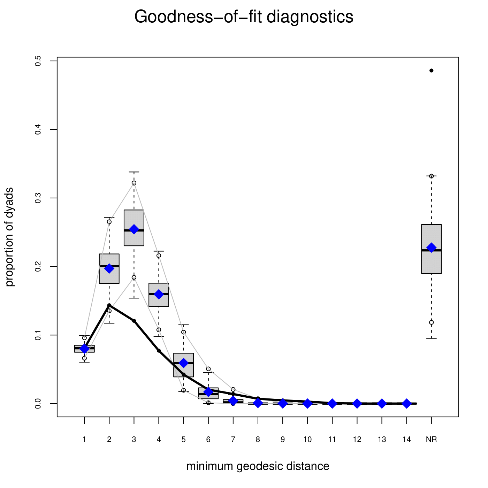{#fig-gof-televoting-5}

Goodness of Fit Televoting
:::


### Model Term Estimates

We saw from the MCMC and goodness-of-fit plots that the model is a good – although not perfect – representation of the observed network. @tbl-term-estimates-televoting presents the ERGM estimates, all statistically significant at $α$=0.05. This allows us to investigate the estimates for the terms in order to test our hypotheses. The estimates of the ERGM are given in the logarithmic scale. For better qualitative understandability, we convert these estimates into probabilities using the formula:

| Term                          | Estimate | Probability | Std. Error | z value | Pr(>z)       |
|-------------------------------|----------|-------------|------------|---------|--------------|
| edges                         | -2.5155  | 0.07478     | 0.3952     | -6.365  | <1e-04 ***   |
| mutual                        | 1.0030   | 0.7316      | 0.3961     | 2.532   | 0.01134 *    |
| gwesp.osp.fixed.0.75          | 0.3263   | 0.5809      | 0.1290     | 2.530   | 0.01140 *    |
| gwideg.fixed.0.25             | -2.6210  | 0.06780     | 0.4828     | -5.428  | <1e-04 ***   |
| gwodeg.fixed.0.5              | 2.1554   | 0.8962      | 0.9362     | 2.302   | 0.02132 *    |
| nodematch.language            | 0.4948   | 0.6212      | 0.1928     | 2.567   | 0.01027 *    |
| edgecov.cultural_dist         | -1.6713  | 0.1583      | 0.6093     | -2.743  | 0.00609 **   |
| edgecov.neighbour             | 1.2119   | 0.7706      | 0.2205     | 5.496   | <1e-04 ***   |

: Model Term Estimates {#tbl-term-estimates-televoting}


$$
p = \frac{e^{\text{estimate}}}{1 + e^{\text{estimate}}}
$$

In the interpretation of the results below, the term “vote” is used to make sense of our results in our domain. Note that this refers to a “tendency to vote“ over a longer period (2016-2023), more than 40% of the time.

The edges term reveals how dense our network is. A negative estimate (indicating a lower probability) means that our network is sparse and the probability of any two nodes forming an edge is low. Out of 1,722 potential edges in a fully connected network of 42 nodes, only 119 are observed.

The mutual term captures the reciprocity in our network. We hypothesised (H5) that countries are more likely to vote for another country if they get a vote from that country. Our positive and significant estimate supports our hypothesis. Country A is 73.2% more likely to vote for Country B if it receives a vote from Country B.

The gwesp term was included to test H6 (countries are more likely to exchange votes if they have a shared preference for a third country). Our estimate tells us that Country A is 58.1% more likely to vote for Country B if they share a preference for a third country (both vote for Country C).

To test whether countries that share similar primary languages are more likely to vote or each other (H2), we can observe our estimate for the nodematch.language term. It tells us that a country is 62.1% more likely to vote for another country if they belong to the same language family.

The edgecov.cultural_dist term tests whether countries with similar cultural dimension scores are more likely to vote for each other (H1). Our estimate is negative which means that culturally more distant countries are less likely to vote for each other, than culturally close ones.

The edgecov.neighbour term tests whether neighbouring countries are more likely to exchange votes (H3). From our estimate, we can see that Country A is 77.1% more likely to vote for Country B if they share a border.

The term measuring the effects of political alignment was excluded in the model precheck phase. Including the term in the ERGM does not affect the goodness of fit, and produces a non-significant estimate for politics. Hence, we have no evidence to support our hypothesis that countries with closer political alignments are more likely to vote for each other (H4).

## Jury Network Results

```{r final_specifications_jury, output = FALSE, eval=FALSE}
model_jury <- ergm::ergm(
  network_jury ~ edges +  mutual +
    gwidegree(0.25, fixed = TRUE) +
    nodematch("language") +
    edgecov(cultural_dist_matrix_scaled) +
    edgecov(neighbor_matrix),
  control = ergm::control.ergm(
    MCMC.burnin = 7000,
    MCMC.samplesize = 20000,
    seed = 1234,
    MCMLE.maxit = 40,
    parallel = 8,
    parallel.type = "PSOCK"
  ))
```

The final specification of the ERGM for the jury network differs slightly due to convergence issues. The gwodegree term was excluded, and the gwidegree term was adjusted with a different decay. Furthermore, the gwesp term, which would test the effect of shared preference on vote exchange, was also removed. These changes to the model specification were necessary to ensure convergence, despite slightly reducing model complexity. Similarly to the televoting network, the analysis completes in only a few minutes. Let us first look at the MCMC diagnostics and goodness of fit for this network as well.

### MCMC Diagnostics

Similarly to the televoting network, again (@fig-mcmc-jury and @fig-mcmc-jury-p2) we have fuzzy traces centred around 0 on the left-hand side, indicating a thorough and balanced search of parameter values. On the right-hand side, we see the distribution of the parameter values in the simulated networks which are normally distributed and centred around 0, as well.

::: {#fig-mcmc-jury layout-ncol=1, layout-nrow=6}

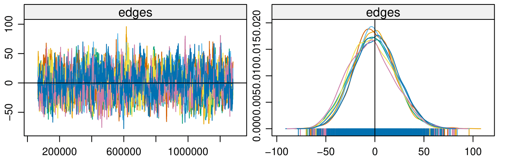{#fig-mcmc-jury-1}

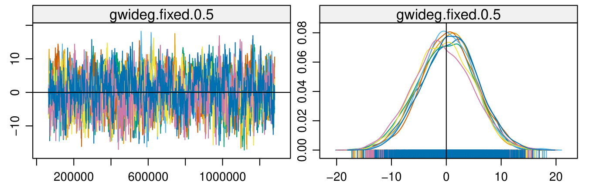{#fig-mcmc-jury-2}

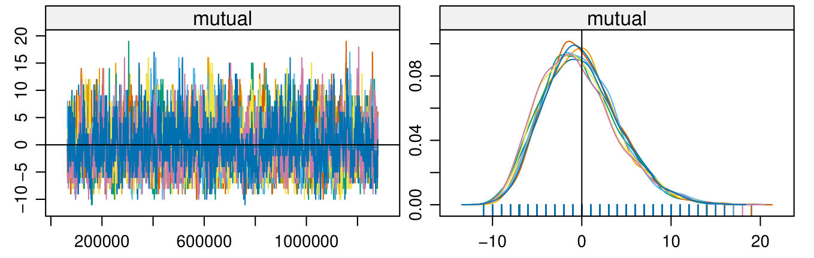{#fig-mcmc-jury-3}

MCMC Diagnostics Jury
:::

::: {#fig-mcmc-jury-p2 layout-ncol=1, layout-nrow=6}
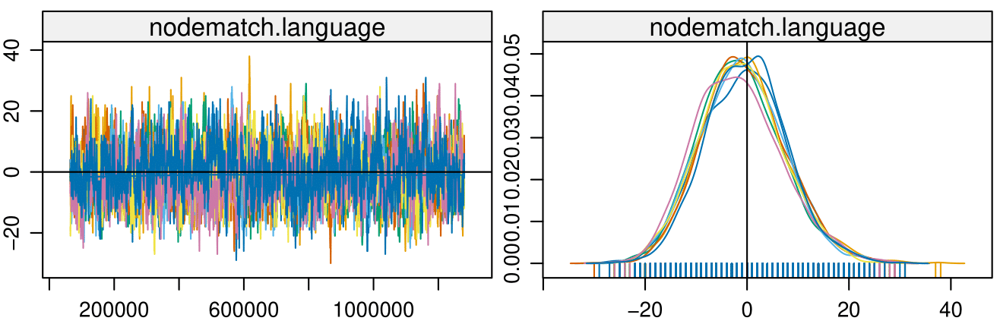{#fig-mcmc-jury-4}

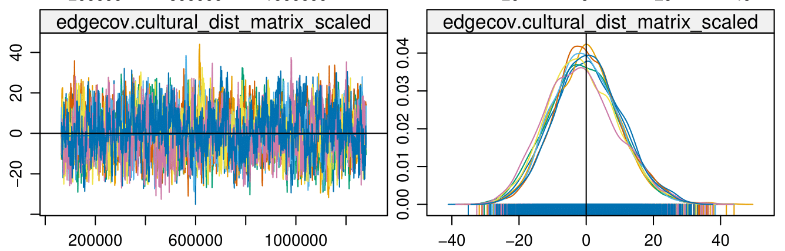{#fig-mcmc-jury-5}

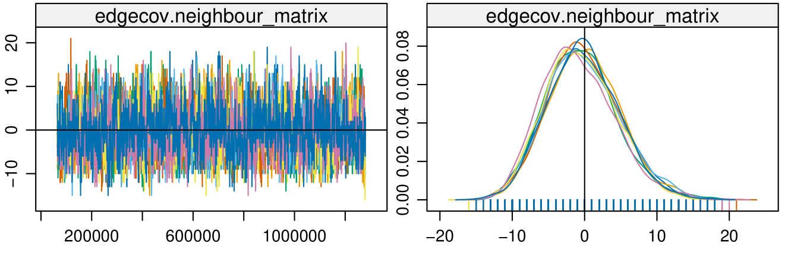{#fig-mcmc-jury-6}

MCMC Diagnostics Jury Part 2
:::

### Goodness-of-Fit

The goodness-of-fit plots (@fig-goodness-of-fit-jury) show that our model is a good estimation of the observed network, and aligns even better than the model for the televoting network. We do not see the same issue with the geodesic distance plot that we observed in case of the televoting network model. About 60% of the nodes of the observed jury network are isolated (no incoming edges), which is in line with the simulation. The similar prediction of the televoting model was off, because only about 40% of the nodes of the observed televoting network are isolated.

::: {#fig-goodness-of-fit-jury layout-ncol=2, layout-nrow=3}

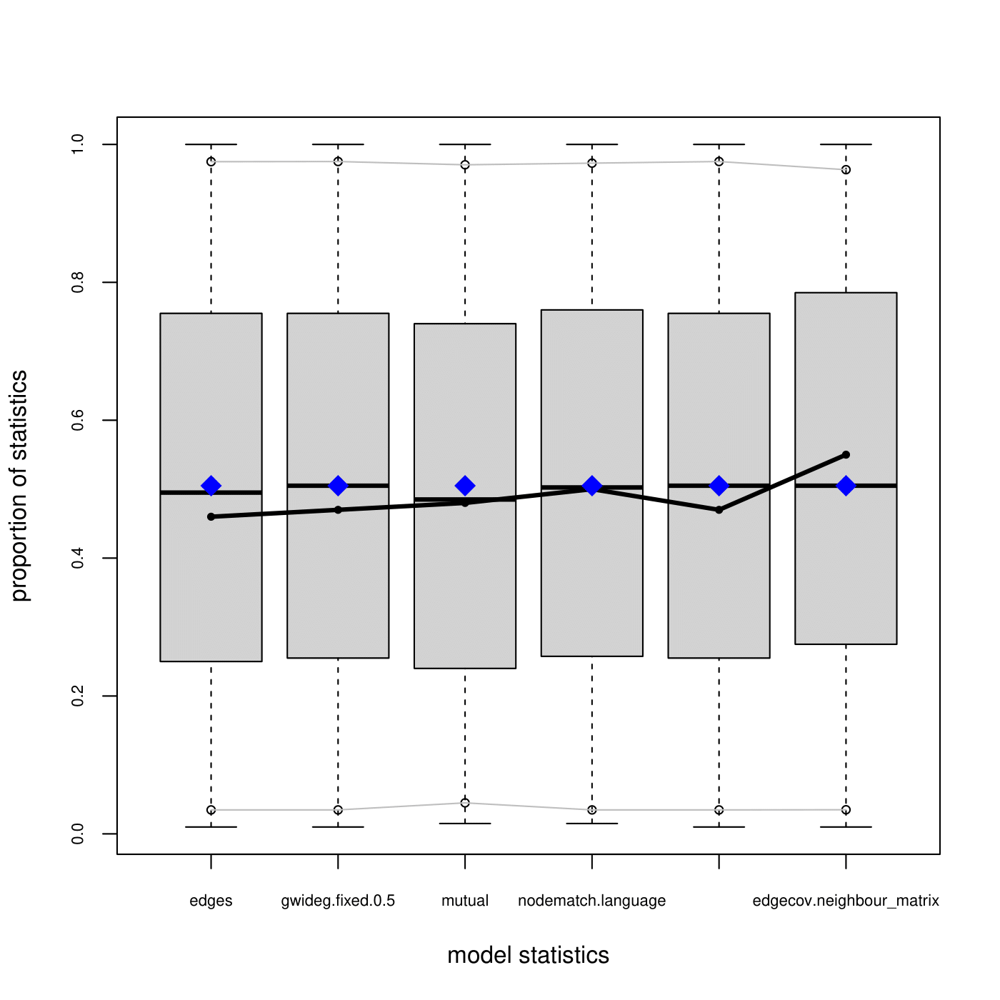{#fig-gof-jury-1}

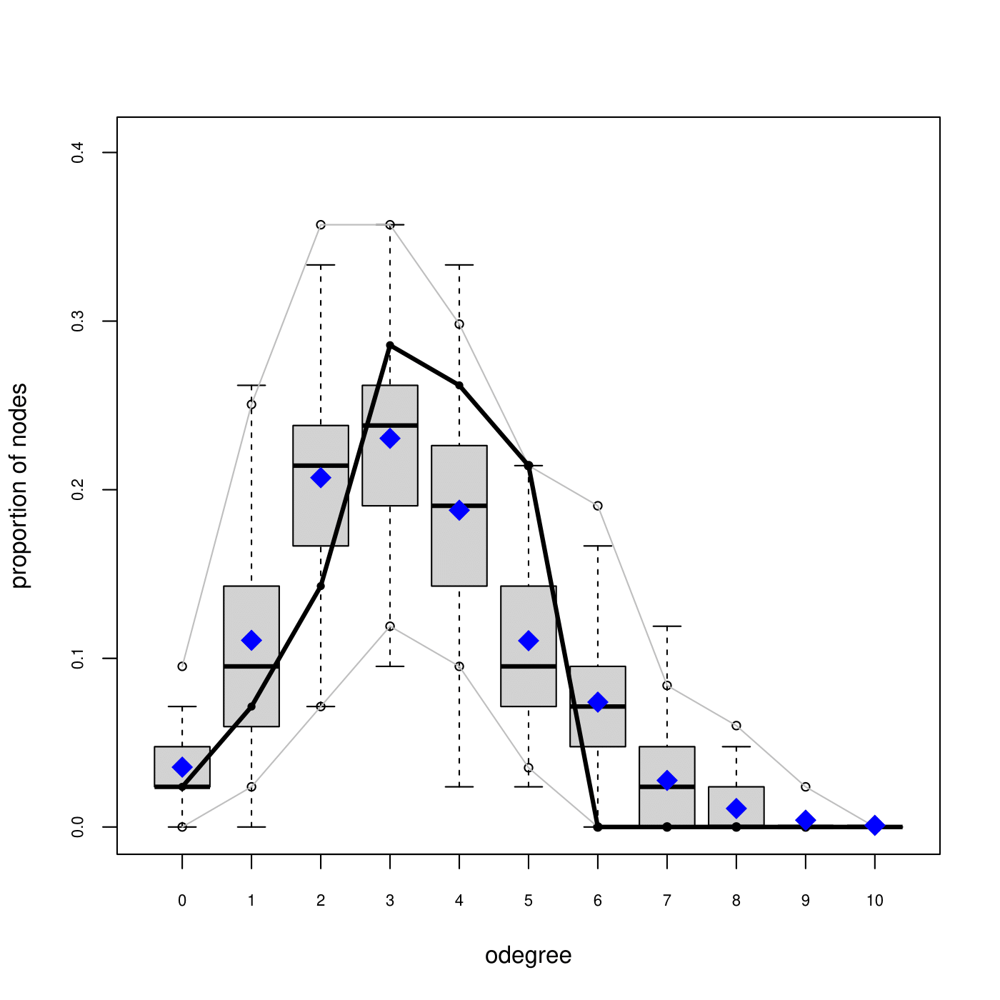{#fig-gof-jury-2}

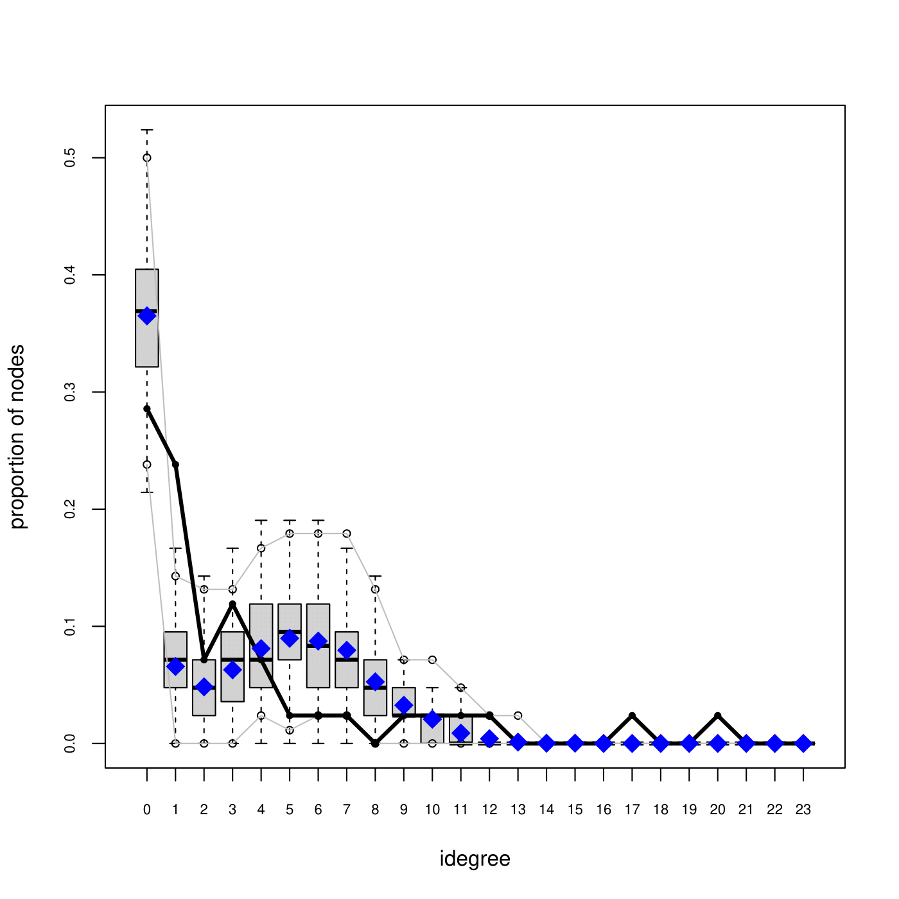{#fig-gof-jury-3}

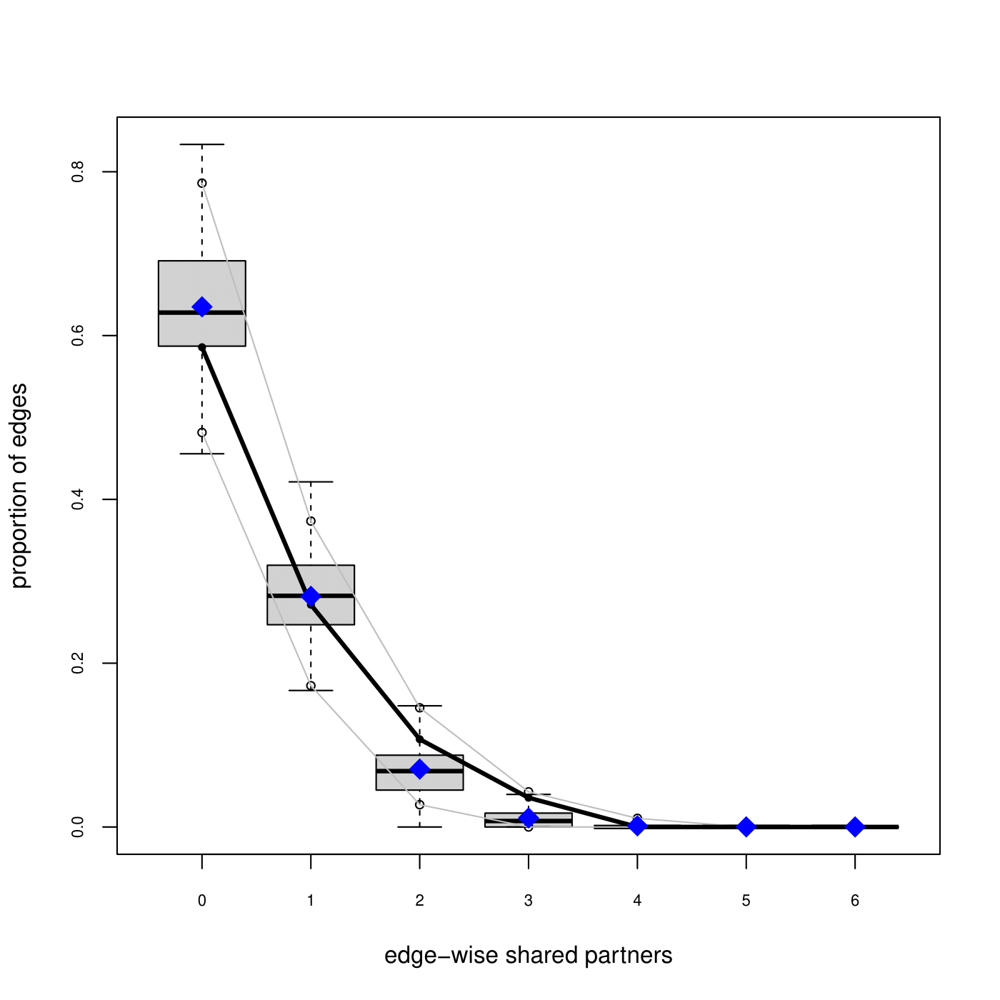{#fig-gof-jury-4}

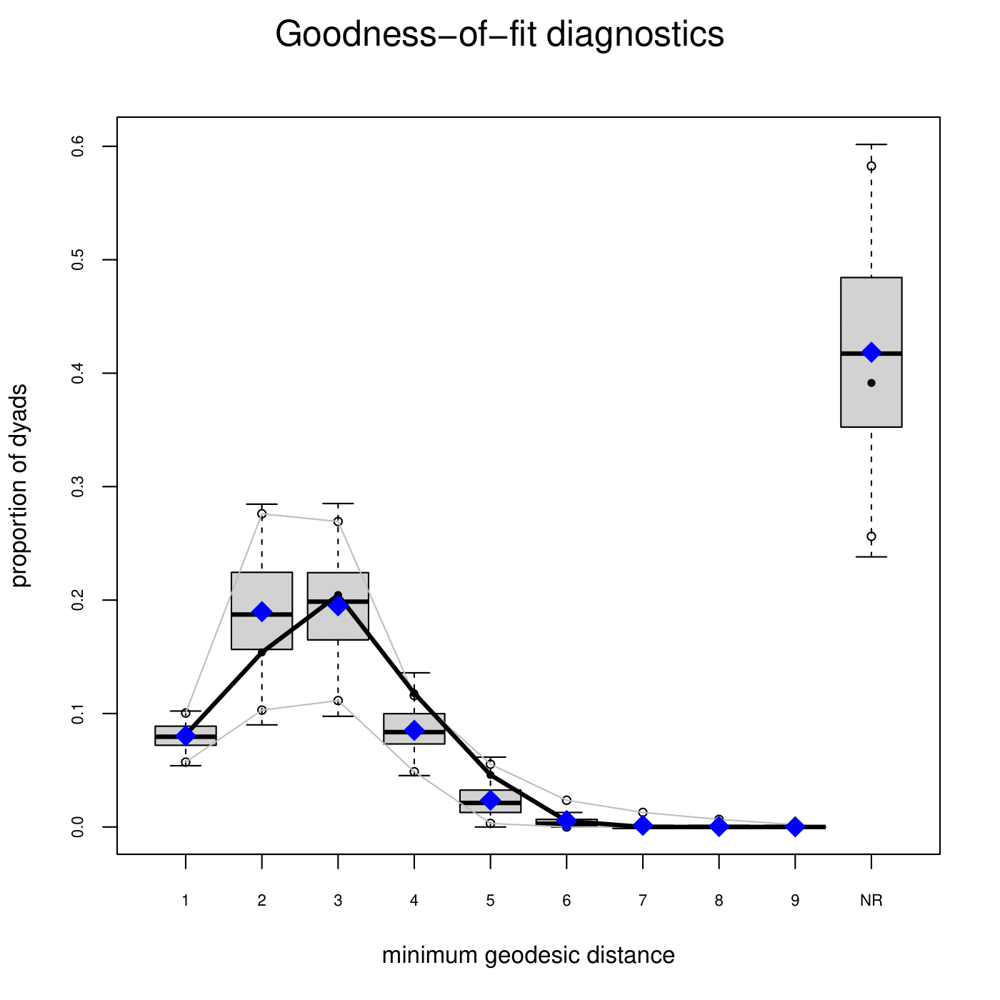{#fig-gof-jury-5}

Goodness of Fit Jury Part 2
:::

### Model Term Estimates

@tbl-term-estimates-jury presents the estimates of the model terms in our jury network ERGM. Similarly to before, we calculate the corresponding probabilities for each term.

| Term                          | Estimate | Probability | Std. Error | z value  | Pr(>z)       |
|-------------------------------|----------|-------------|------------|----------|--------------|
| edges                         | -1.7188  | 0.1520      | 0.2785     | -6.171   | <1e-04 ***   |
| mutual                        | 1.0985   | 0.7500      | 0.4021     | 2.732    | 0.00630 **   |
| gwideg.fixed.0.5              | -4.1598  | 0.01537     | 0.3982     | -10.447  | <1e-04 ***   |
| nodematch.language            | 0.5426   | 0.6324      | 0.2048     | 2.649    | 0.00807 **   |
| edgecov.cultural_dist         | -0.6023  | 0.3538      | 0.5052     | -1.192   | 0.23319      |
| edgecov.neighbour             | 0.2215   | 0.5551      | 0.2978     | 0.744    | 0.45709      |

: Model Term Estimates {#tbl-term-estimates-jury}

From the edges term, we can again see that our network is sparse, containing 42 nodes and 107 edges. The positive estimate for the mutual term, significant at α=0.05 supports our hypothesis about reciprocity in case of the jury network as well, similarly to the televoting network. The jury of a country is 75% more likely to vote for another country if they tend to receive a vote from that country. We again find language to be a statistically significant predictor of votes. Two countries’ juries are 63.2% more likely to exchange votes if their primary languages belong to the same language family. Cultural distance and neighbourhood effect are non-significant in case of the jury network.

# Discussion & Conclusion
In this study, we used ERG models to analyse public and jury voting patterns in the Eurovision Song Contest from 2016 to 2023. Our models demonstrated a good fit with observed networks, allowing us to explore the impact of cultural, linguistic, and geographical proximities, as well as reciprocity and shared voting preferences on voting behaviour.

In case of the televoting network, we found that cultural and linguistic proximity both increased the chance of a vote exchange between countries. Furthermore, we saw that neighbouring countries are also more likely to vote for each other. Our results also supported our hypotheses that countries tend to reciprocate voting, and that a shared preference for a third party increases the chances of a vote exchange.

In case of the jury network, we only found statistically significant results for reciprocity and language. In this case, we could not support our hypotheses about cultural and geographical proximities’ effects on the votes.

While the two models cannot be directly contrasted, the differences in findings between televoting and jury networks suggest that cultural and geographical biases are more pronounced in televoting. This aligns with the notion that professional juries may prioritize song and performance quality over cultural or regional affinities, leading to less biased voting patterns.

A recent 2023 rule change means that in the semifinals the expert jury will no longer give out votes. Musicologist Helen Julia Minors addressed this change as a potential to reduce the risk of political bias in the contest [@Ruggeri2023]. This is somewhat contradicted by our findings. Although no conclusions could be drawn from the effect of political alignment on the votes, the observed cultural and geographical effect might be an indication of a more biased voting behaviour of televoters than juries. Thus, relying solely on televoting could inadvertently amplify these biases.

Given the results, one might consider what could be done to improve the fairness of the contest. Secret voting would mean that countries do not know whether they get voted on by other countries, or if they share preferences with others. This could mitigate the risk of clique formation and reciprocity. On the other hand, it could potentially increase the chance of withholding votes from strong competitors, and perhaps also take away from the entertainment value.

From a broader perspective, Eurovision voting offers a lens through which group self-assessment decision-making can be studied. Biases in voting behaviour, driven by cultural, linguistic, or strategic considerations, reflect the challenges faced in analogous voting scenarios beyond the contest. Public datasets like Eurovision's provide a valuable resource for analysing these dynamics and drawing generalizable insights.

## Suggestion for future research

Besides the effects that were investigated, we suspect that migration and ethnic groups can also play a role in shaping voting patterns. We did not pursue this direction because of the difficulty to find adequate data about the population of all possible minorities in each country in our network. These effects could be analysed in future research in this area.

In addition, one could look at the change in the votes over the years. As mentioned before, most of our conducted papers analysed voting more than 20 years ago. It would be interesting to see how the investigated effects have changed, whether they play a stronger or weaker role in the contest.

\newpage

# References

\begingroup
\setlength{\parindent}{-0.5in}
\setlength{\leftskip}{0.5in}

<div id="refs" custom-style="Bibliography"></div>
\endgroup

\newpage

# Appendix A - Results with $λ$=0.6 {.appendix}

## Televoting Network

The MCMC Diagnostics and the Goodness of Fit plots for the televoting network with $λ$=0.6 are presented below in @fig-mcmc-televoting-06, @fig-mcmc-televoting-06-p2, and @fig-goodness-of-fit-televoting-06. The model term estimates are shown in @tbl-televoting-results-06.

| **Parameter**              | **Estimate** | **Std. Error** | **MCMC %** | **z value** | **Pr(>z)**       |
|----------------------------|--------------|----------------|------------|-------------|------------------|
| edges                     | -3.1010      | 0.4706         | 0          | -6.590      | < 1e-04 ***      |
| mutual                    | 1.4661       | 0.4867         | 0          | 3.012       | 0.002592 **      |
| gwesp.OSP.fixed.0.75      | 0.2118       | 0.1828         | 0          | 1.159       | 0.246500         |
| gwideg.fixed.0.25         | -1.9327      | 0.4728         | 0          | -4.088      | < 1e-04 ***      |
| gwodeg.fixed.0.5          | 0.8205       | 0.6179         | 0          | 1.328       | 0.184243         |
| nodematch.language        | 0.9390       | 0.2460         | 0          | 3.817       | 0.000135 ***     |
| edgecov.cultural_dist     | -1.1942      | 0.7081         | 0          | -1.686      | 0.091701 .       |
| edgecov.neighbour_matrix  | 1.3359       | 0.2617         | 0          | 5.104       | < 1e-04 ***      |

: Monte Carlo Maximum Likelihood Results with $λ$=0.6 {#tbl-televoting-results-06}

::: {#fig-mcmc-televoting-06 layout-ncol=1, layout-nrow=8}

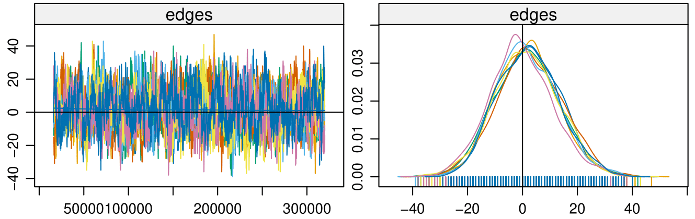{#fig-mcmc-televoting06}

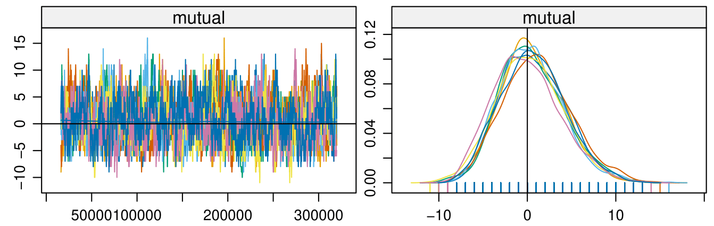{#fig-mcmc-televoting06}

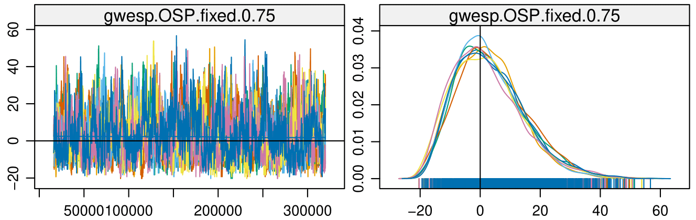{#fig-mcmc-televoting06}

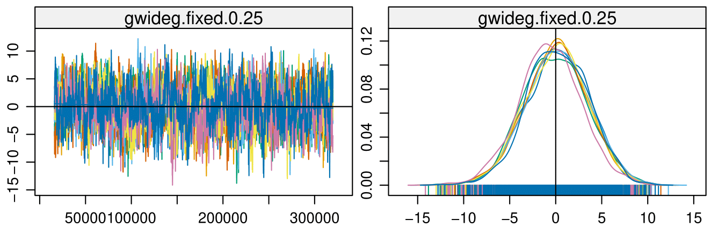{#fig-mcmc-televoting06}

MCMC Diagnostics Televoting with $λ$=0.6
:::

::: {#fig-mcmc-televoting-06-p2 layout-ncol=1, layout-nrow=8}
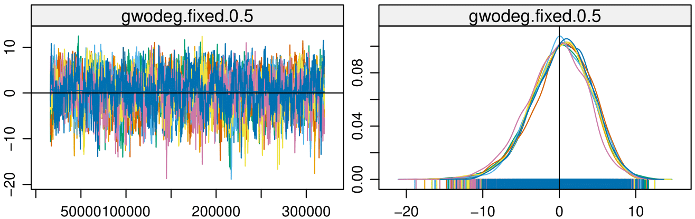{#fig-mcmc-televoting06}

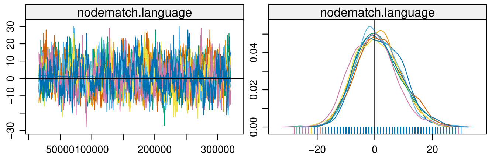{#fig-mcmc-televoting06}

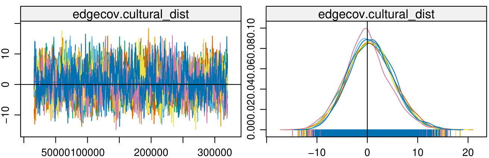{#fig-mcmc-televoting06}

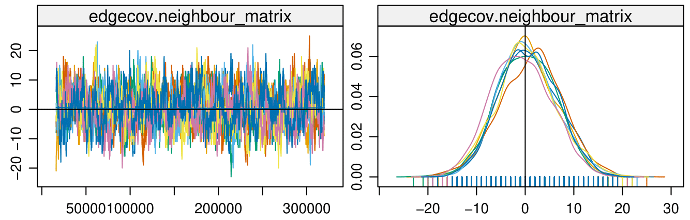{#fig-mcmc-televoting06}

MCMC Diagnostics Televoting with $λ$=0.6 Part 2
:::

::: {#fig-goodness-of-fit-televoting-06 layout-ncol=2, layout-nrow=3}

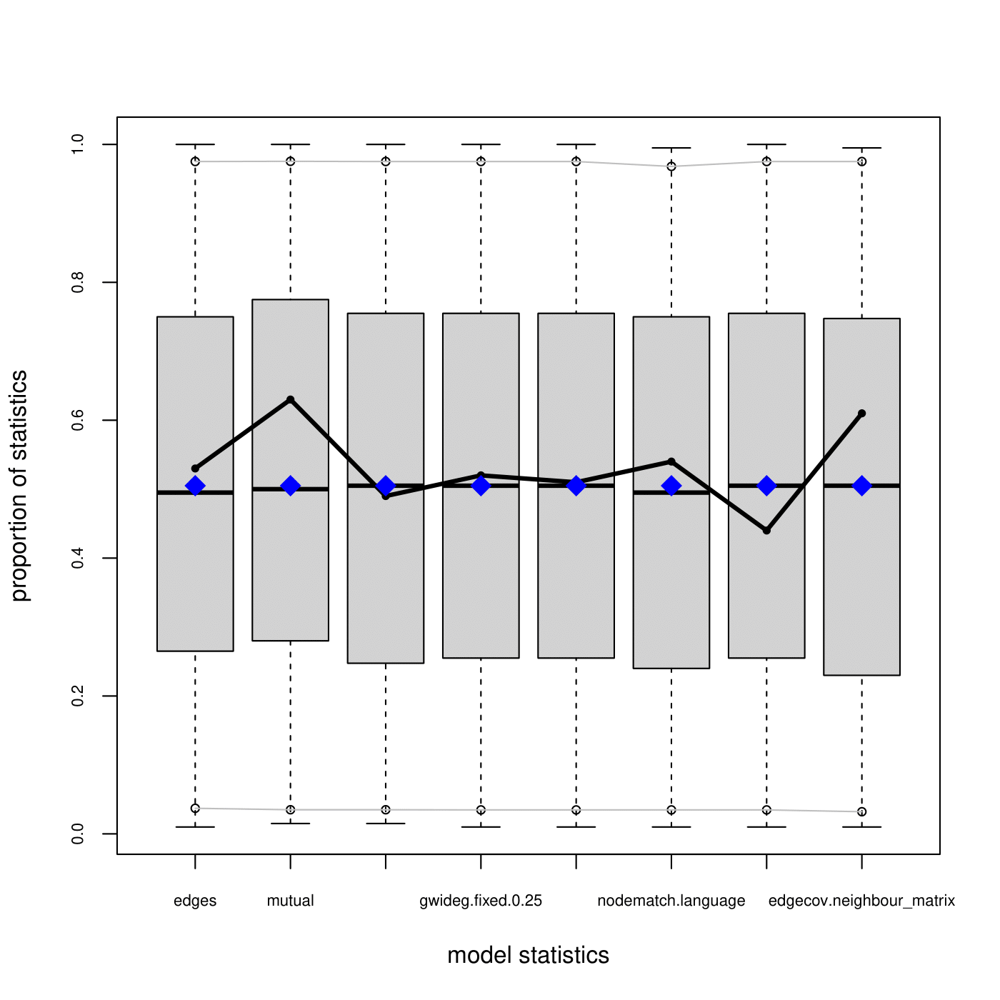{#fig-gof-televoting-1-06}

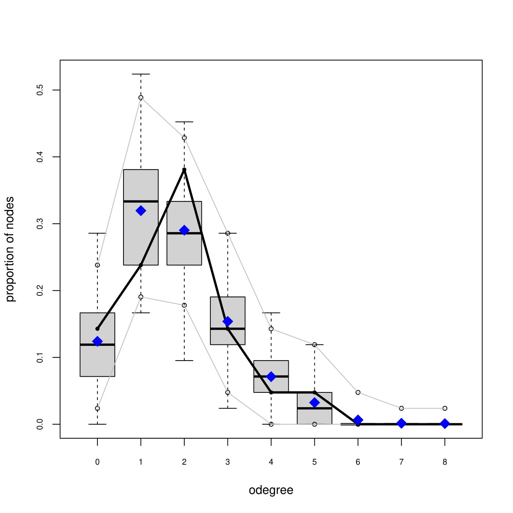{#fig-gof-televoting-2-06}

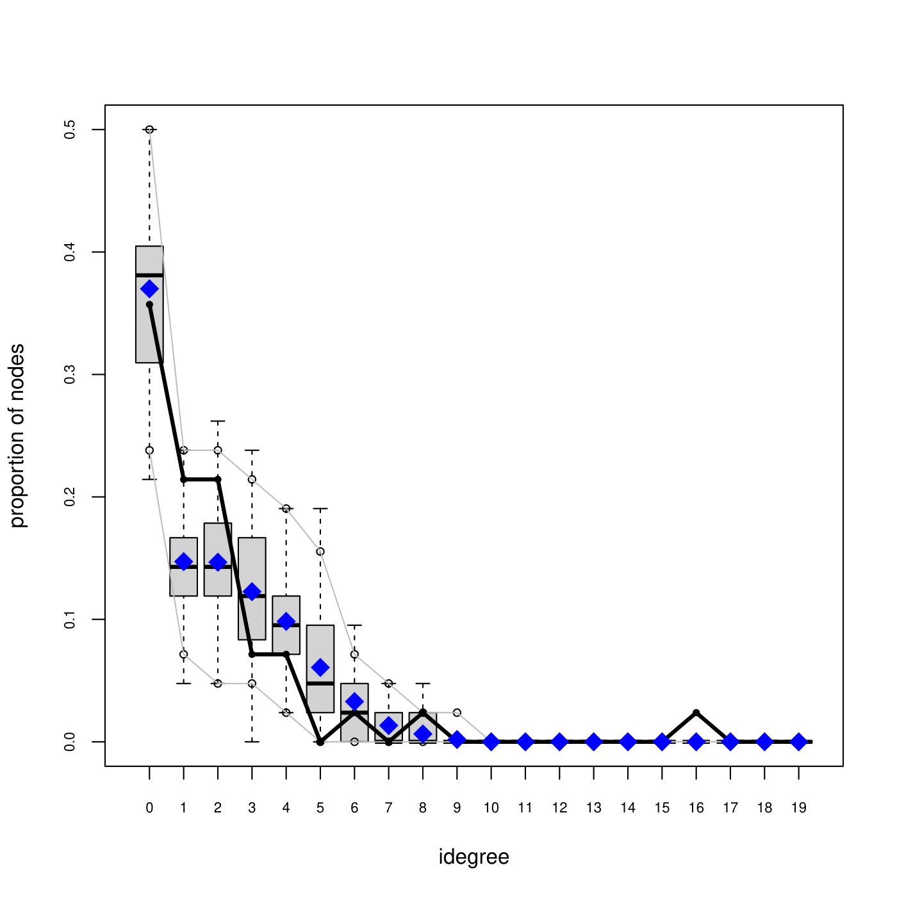{#fig-gof-televoting-3-06}

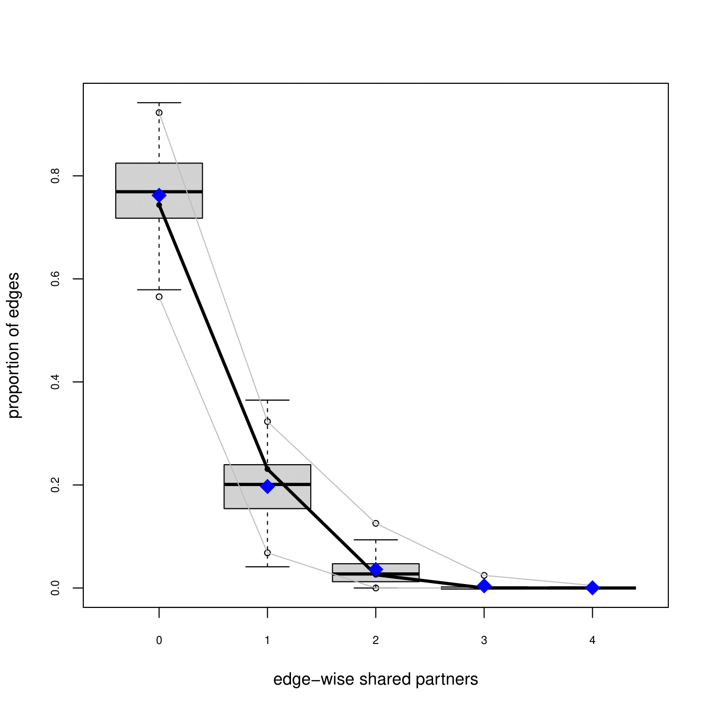{#fig-gof-televoting-4-06}

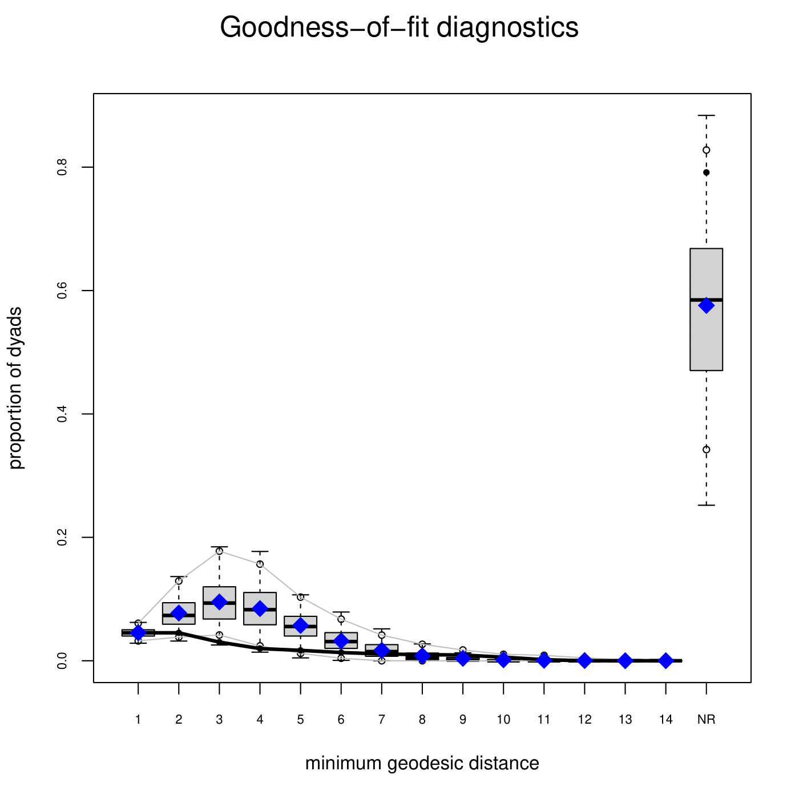{#fig-gof-televoting-5-06}

Goodness of Fit Televoting with $λ$=0.6
:::

## Jury Network

Using a threshold $λ$=0.6, only leaves 23 edges for 42 nodes in the jury network, which makes running the ERGM difficult and useless, as most of the nodes are isolated. Choosing $λ$=0.4 as a threshold for the jury network was reasonable.